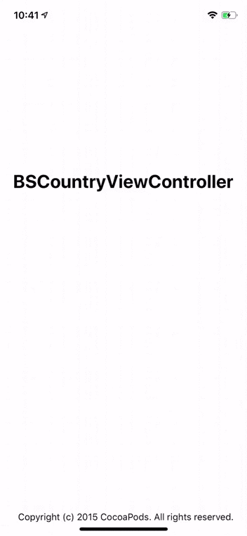

# BSCountryViewController

[](https://travis-ci.org/Adobels/BSCountryViewController)
[](https://cocoapods.org/pods/BSCountryViewController)
[](https://cocoapods.org/pods/BSCountryViewController)

## Requirements

Minimum: Swift 5.1.0, Xcode 11.0.0, iOS 13.0.0

## Installation

BSCountryViewController is available through [CocoaPods](https://cocoapods.org). To install
it, simply add the following line to your Podfile:

```ruby
pod 'BSCountryViewController'
```

## Usage

```swift
    let vc = BSCountryViewController()
    vc.delegate = self
    present(vc, animated: true, completion: nil)
```

## Screenshot


